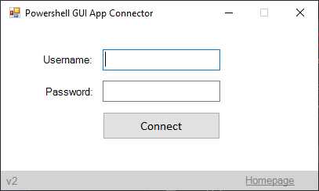

# Powershell GUI App
I created this Powershell GUI App for users to be able to connect to network drives/printers with a GUI interface using their domain credentials.  

## How to Execute this program? 
This application/script was created from a windows machine and as such is intended for Windows Operating systems for execution. 

To execute this program you can simply right click and click on the "Run with Powershell" option. 

To make this more "user friendly" you will need a *Powershell to .EXE converter.*

There are many .ps1 to .exe convertors however the one I have used is from [Sapien Technologies](https://www.sapien.com/software/powershell_studio).


```Powershell
# These network drive variables will need to be changed and altered to your site.

$S_Drive = "\\XXX.XXX.XXX\Software$"
$W_Drive = "\\XXX.XXX.XXX\StaffData$"
$Q_Drive = "\\XXX.XXX.XXX\Data"
$G_Drive = "\\XXX.XXX.XXX\General"
$P_Drive = "\\XXX.XXX.XXX\TestData"
```

### Application Preview

